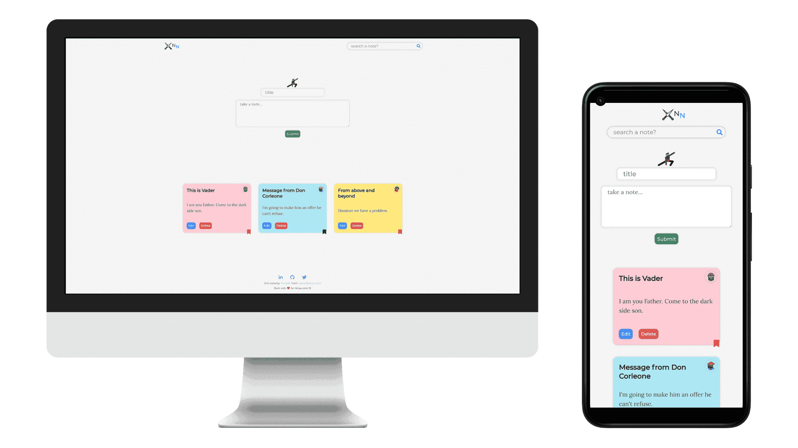

# Pied Piper
Quick-notes app (for ninjas 🐱‍👤) with localStorage for data persistency and privacy.

### live @ https://sanjibdey104.github.io/ninja-notes/

### Tech Stack
- Vanilla JS
- SCSS
- localStorage

### Mockup

## Features
- User can add, update and delete a note
- Important notes can be bookmarked
- Search notes by title or content

## Goal
- Learn how to implement full CRUD operation with plain JavaScript.
- Using localStorage for persisting data locally at the user's end.

## Learnings
- Implementing full CRUD operation with vanilla javascript.
- Using localStorage for data persistency.
- Extend application scope to features like bookmarking and search option.   

## Challenges
- Syncing localStorage with data updates.
- Adding bookmarking option.

## Prospective
- Option to assign a label/category to the notes.
- Notes filtering by category.
- Application theme options.

### Attributions:
- SVG icons by [Freepik](https://www.freepik.com)
