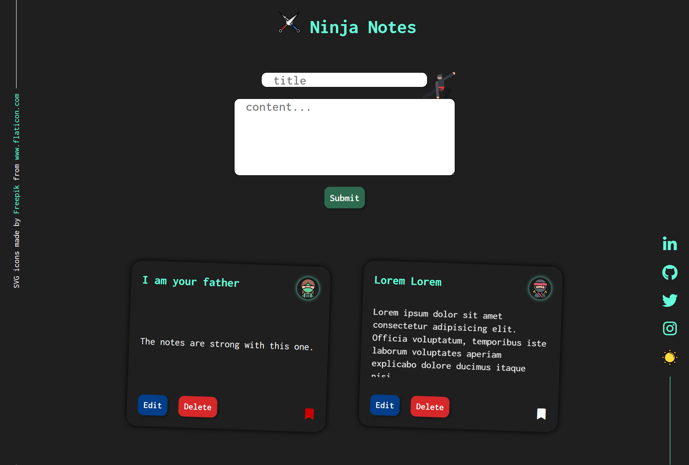

# Ninja Notes
> A CRUD note taking app

### live app link: https://sanjibdey104.github.io/ninja-notes/

### Table of contents
* [General info](#general-info)
* [Screenshots](#screenshots)
* [Technologies](#technologies)
* [Features](#features)
* [Status](#status)
* [Inspiration](#inspiration)
* [Attribution](#attribution)
* [Contact](#contact)

## General info
The purpose is to serve as a basic note-keeping application.

## Screenshots

## Technologies
* Vanilla Javascript
* HTML5
* SASS

## Features

* User can create, edit, delete a new note
* Bookmark important notes
* Toggle application theme (dark/light)
* Data persistence using localstorage
* Mobile and Desktop responsiveness

   ### To-do list:
   * Allow user to search for a note
   * Allow category tags for better note sorting

## Status
Project is live with above features and in-progress with the "to-do" scope

## Inspiration
* Dark theme and sidebar is inspired by none other than [Brittany Chaiang's Portfolio Website](https://brittanychiang.com/)
* Thanks to Rita for this [readme cheatsheet](https://github.com/ritaly/README-cheatsheet)

## Attribution
* SVG icons made by [Freepik](https://www.freepik.com) from [www.flaticon.com](https://www.flaticon.com)

## Contact
Created by [@sanjib104](https://twitter.com/Sanjib_104) 

Mail: sanjibdey.dey4@gmail.com

   *feel free to contact me!*

